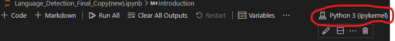

# nlp

Natural Language Processing (NLP) is a branch of artificial intelligence associated with enabling computers or machines to understand human languages in different forms (text or speech)

[Exporting Requirements](https://nbconvert.readthedocs.io/en/latest/install.html#supported-python-versions)

You can run this in either Google Colab [Google Colab](#google-colab) or [Visual Studio Code](#vscode)

## Requirements
- Docker
- Visual Studio Code
- [Dev Containers](https://marketplace.visualstudio.com/items?itemName=ms-vscode-remote.remote-containers): https://marketplace.visualstudio.com/items?itemName=ms-vscode-remote.remote-container
- CUDA Enabled NVIDIA GPU (optional)
- NVIDIA CUDA Toolkit (optional)

## How to run

### Google Colab

- Setup a runtime by starting a runtime. 
- Navigate to the navbar and selecting **Runtime > Run all** or use the hotkey `Ctrl+F9` to run all cells in the notebook

### VSCode

1. Prior to opening the repository in VSCode, make sure the requirements are met.
2. Start the container by using the hotkey `CTRL+SHIFT+P` to open the command palette and selecting the option indicated 
3. Ensure you have the kernel selected. 
4. Run all cells following the attached image. 
